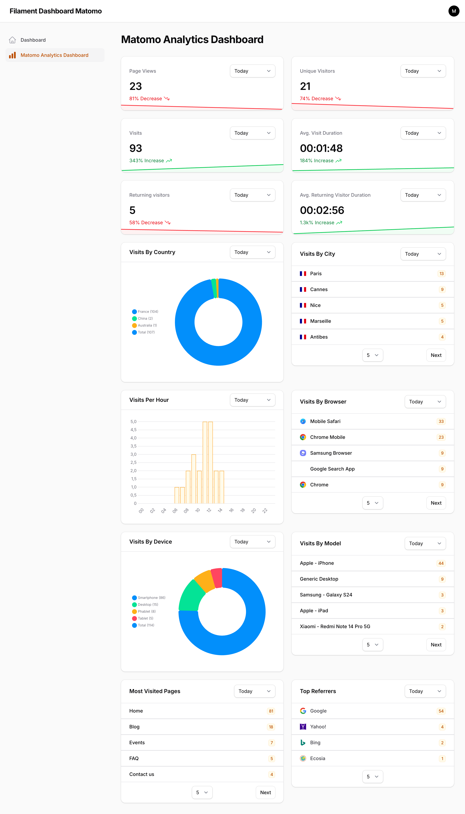
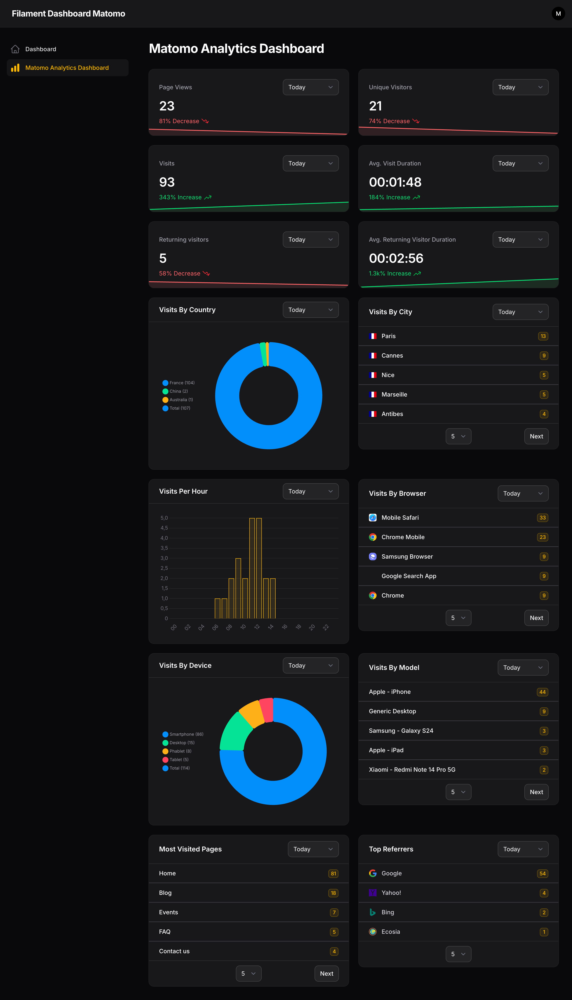

<a href="https://github.com/agencetwogether/matomo-analytics" class="filament-hidden">

</a>

<p align="center" class="flex items-center justify-center">
    <a href="https://filamentphp.com/docs/4.x/introduction/installation">
        
    </a>
    <a href="https://filamentphp.com/docs/5.x/introduction/installation">
        
    </a>
    <a href="https://packagist.org/packages/agencetwogether/matomo-analytics">
        
    </a>
    <a href="https://github.com/agencetwogether/matomo-analytics/actions?query=workflow%3A"Check+%26+fix+styling"+branch%3Amain" class="filament-hidden">
        
    </a>
    <a href="https://packagist.org/packages/agencetwogether/matomo-analytics">
        
    </a>
    <a href="https://matomo.org">
        
    </a>
<p>

# Matomo Analytics for Filament

Matomo Analytics for Filament integration for Filament Panels with a set of widgets to display your analytics data in a beautiful way.

## Features

- Matomo statistics in Filament dashboard
- Page views
- Unique visitors
- Visit duration
- Country statistics
- City statistics
- Period filters...

> [!NOTE]  
> Matomo is a trademark of the [Matomo project](https://matomo.org/). This plugin is not affiliated with or endorsed by Matomo.

> [!NOTE]  
> This package is an adaptation of [bezhanSalleh/filament-google-analytics](https://github.com/bezhanSalleh/filament-google-analytics), updated to work with Matomo Analytics for Filament.
Thanks to him

## Installation

You can install the package in a Laravel app that uses [Filament](https://filamentphp.com) via composer:

```bash
composer require agencetwogether/matomo-analytics
```

> [!IMPORTANT]
> If you have not set up a custom theme and are using Filament Panels follow the instructions in the[Filament Docs (V4)](https://filamentphp.com/docs/4.x/styling/overview#creating-a-custom-theme), [Filament Docs (V5)](https://filamentphp.com/docs/5.x/styling/overview#creating-a-custom-theme) first.

After setting up a custom theme add the following to your theme css file.

```css
@source '../../../../vendor/agencetwogether/matomo-analytics/resources/views/**/*';
@source '../../../../vendor/agencetwogether/matomo-analytics/src/{Widgets,Support}/*';
```

Then rebuild your assets:
```bash
npm run build
```

### First you need to retrieve credentials from your Matomo instance (self-hosted or cloud)
#### Matomo API Key
To generate a new API Key go to **Administration->Personal->Security** and click on **Create new token button**.
- Give a description as you want,
- Uncheck ```Only allow secure requests```
- And set or no an exire date.

#### Matomo Base Url
Copy Url of your instance with ```http``` or ```https``` prefix and remove slash (```/```) at the end.
For example, your base Url must be like : ```https://analyse.domain.com```

#### Matomo ID Site
To retrieve ID of your website you want to track, go to **Administration->Websites->Manage** and copy the ID below site name.

After that, add these credentials to the `.env` for your Filament PHP app:
```bash
MATOMO_API_KEY=
MATOMO_BASE_URL=
MATOMO_ID_SITE=
```
For example, it might look like this
```bash
MATOMO_API_KEY="d26fa64666d15073d9a8e49101422c06"
MATOMO_BASE_URL="https://analyse.domain.com"
MATOMO_ID_SITE=1
```

### Registering the plugin
```php
use Agencetwogether\MatomoAnalytics\MatomoAnalyticsPlugin;

public function panel(Panel $panel): Panel
{
    return $panel
        ->plugins([
            //...
            MatomoAnalyticsPlugin::make()
        ]);
}
```

## Available Widgets

```php
use Agencetwogether\MatomoAnalytics\Widgets;

Widgets\PageViewsWidget::class, // Displays the total number of page views
Widgets\VisitorsWidget::class, // Displays the number of unique visitors
Widgets\VisitsWidget::class, // Displays the total number of visits
Widgets\VisitsDurationWidget::class, // Shows the average duration of visits
Widgets\VisitorsFrequenciesWidget::class, // Shows visitor frequency (returning visitors)
Widgets\VisitorsFrequenciesDurationWidget::class, // Shows visit duration based on visitor frequency
Widgets\VisitsByCountryWidget::class, // Displays visits grouped by country
Widgets\VisitsByCityWidget::class, // Displays visits grouped by city
Widgets\VisitsPerHourWidget::class, // Shows visits distribution by hour of the day
Widgets\VisitsByBrowserListWidget::class, // Lists visits by browser
Widgets\VisitsByDeviceWidget::class, // Displays visits by device type (desktop, mobile, tablet)
Widgets\VisitsByModelListWidget::class, // Lists visits by device model
Widgets\MostVisitedPagesWidget::class, // Displays the most visited pages
Widgets\TopReferrersListWidget::class, // Lists the top traffic referrers
```

## Usage

You can display the widgets in several ways: 
1. [In the default Filament Dashboard](#default_dashboard)
2. [In the Dashboard provided by the plugin](#plugin_dashboard) 
3. [In a custom Dashboard](#custom_dashboard) 
4. [In any page or resource](#any_page)

To manage these displays, publish the configuration file:
```bash
 php artisan vendor:publish --tag=matomo-analytics-config
```
Then modify the settings depending on your use case.

**<a id="default_dashboard"></a>1. Default Filament Dashboard**

For the desired widget, set the value ```filament_dashboard``` to ```true```  
*Example:*
```php
'widgets' => [
    'page_views' => [
        'filament_dashboard' => true,
        // ..
    ],
],
```

**<a id="plugin_dashboard"></a>2. Dashboard provided by the plugin**

Ensure ```dedicated_dashboard``` is set to ```true``` in config file to show dashboard provided by the plugin.  
For the desired widget, set the value ```plugin_dashboard``` to ```true```  
*Example:*
```php
'widgets' => [
    'visits_by_browser_list' => [
        // ..
        'plugin_dashboard' => true,
        // ..
    ],

    'most_visited_pages' => [
        // ..
        'plugin_dashboard' => true,
        // ..
    ],
],
```

**<a id="custom_dashboard"></a>3. Custom Dashboard**

Though this plugin comes with a default dashboard, but sometimes you might want to change `navigationLabel` or `navigationGroup` or personalize some `widgets` or any other options.  
The easiest solution would be to disable the default dashboard and create a new page.

First, create a page using the command:

```bash
php artisan make:matomo-page MyCustomDashboardPage
```

This page extends the base page ```MatomoBaseAnalyticsDashboard``` and implement the ```HasMatomoWidgets``` interface.
```php
<?php

namespace App\Filament\Pages;

use Agencetwogether\MatomoAnalytics\Contracts\HasMatomoWidgets;
use Agencetwogether\MatomoAnalytics\Pages\MatomoBaseAnalyticsDashboard;
use Agencetwogether\MatomoAnalytics\Widgets;

class MyCustomDashboardPage extends MatomoBaseAnalyticsDashboard implements HasMatomoWidgets
{
    protected static ?string $title = 'My Custom Dashboard';
    
    public function getMatomoWidgets(): array
    {
        return [
            Widgets\PageViewsWidget::class,
            Widgets\VisitorsWidget::class,
            //Add other widgets
        ];
    }
}
```

You must register the widgets you want to show in the ```getMatomoWidgets()``` method and set their ```custom_pages``` values to ```true``` in the configuration file.  
*Example:*
```php
'widgets' => [
    'page_views' => [
        // ..
        'custom_pages' => true,
    ],
    'visitors' => [
        // ..
        'custom_pages' => true,
    ],
],
```

**<a id="any_page"></a>4. Other Page or Resource page**

You have to register the desired widgets in the page’s ```getHeaderWidgets()``` or ```getFooterWidgets()``` method.

```php
use Agencetwogether\MatomoAnalytics\Widgets;

protected function getHeaderWidgets(): array
{
    return [
        Widgets\VisitsByCountryWidget::class,
        Widgets\VisitsByCityWidget::class,
    ];
}
```

And in the configuration file, set the ```custom_pages``` value to ```true``` for the selected widgets.  
*Example:*
```php
'widgets' => [
    'visits_by_country' => [
        // ..
        'custom_pages' => true,
    ],
    'visits_by_city' => [
        // ..
        'custom_pages' => true,
    ],
],
```

#### Manage cache
By default, responses from requests to the Matomo server are cached to avoid sending too many requests and to optimize widget rendering.  
You can enable or disable caching widgets and set custom time to cache per filter (in minutes).
See config file to manage this feature.

> [!NOTE]  
> If the Matomo server request fails or is unavailable, a widget will appear indicating that the data may be outdated or empty.
However, the cache still allows the data from the last successful synchronization to be displayed (only in default Filament Dashboard, Dashboard provided by the plugin and Custom Dashboard)


## Preview
Widgets rendered in a dedicated dashboard (or any other page you create)



## Changelog

Please see [CHANGELOG](CHANGELOG.md) for more information on what has changed recently.

## Contributing

Please see [CONTRIBUTING](.github/CONTRIBUTING.md) for details.

## Security Vulnerabilities

Please review [our security policy](.github/SECURITY.md) on how to report security vulnerabilities.

## Credits

- [Bezhan Salleh](https://github.com/bezhanSalleh)
- [Agence Twogether](https://github.com/agencetwogether)
- [All Contributors](../../contributors)

## License

The MIT License (MIT). Please see [License File](LICENSE.md) for more information.
